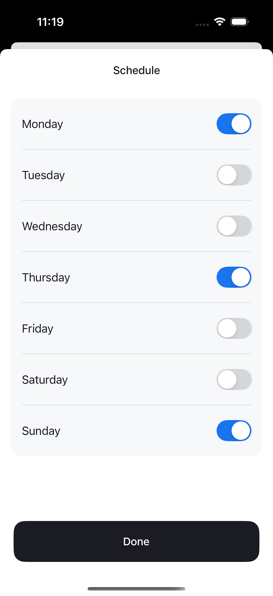

# 📱 Tracker — habit and event management

An iOS application that allows users to track their habits, goals, tasks. Users can add, edit, delete, and filter habits by categories with a clean, localized interface.

## Tech Stack
- Swift
- UIKit
- Core Data
- MVVM architecture
- Auto Layout (programmatic, no Storyboard)
- UITableView
- UICollectionView
- Custom alerts with validation
- NotificationCenter
- Analytics with Yandex metrica

## Features
- View a list of tracker categories
- Add new categories
- Edit and delete existing categories
- Context menu on long press
- Empty state UI
- ViewModel and delegate usage
- Programmatic UI and dynamic layout

## 🌍 Localization

- English 🇺🇸
- Russian 🇷🇺

The app automatically adapts to the device's language settings.

## 🖼 Screenshots

    

## 🔧 Installation

1. Clone the repository and run  `Tracker.xcodeproj` on iPhone Simulator (iOS 15.6 or later).
